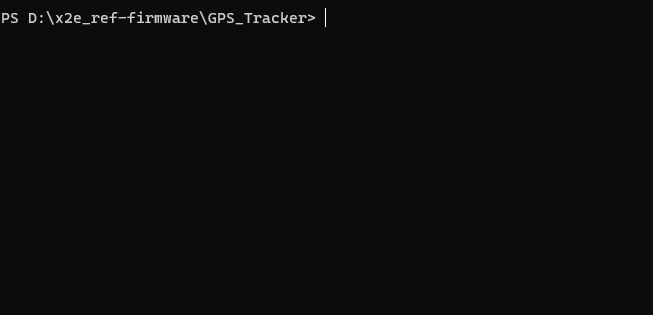
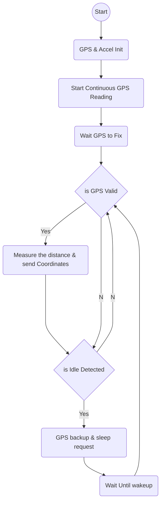

# MatchX X2E_Reference_Sensor


[](https://docs.espressif.com/projects/esp-idf/en/v4.4.5/esp32s3/get-started/index.html) [](https://github.com/MatchX-GmbH/X2E-Reference-Sensor-HW)

# Example GPS_Tracker

This is an example GPS Tracker sensor that utilizes the LPWAN network (subGHz and 2.4GHz). The project is completely open-source, allowing you to use it as a starting point for developing your custom sensor. With this example, you can easily track the device for a configurable period and measure the total distance traveled. The data is then transmitted using the LPWAN technology over either subGHz or 2.4GHz frequencies.

# Features

- Periodically sends coordinates and measures the total distance traveled.
- Idle detection using GPS speed data and Accelerometer for accurate distance measurement.
- Optional average filter to reduce total distance error.
- Sleep mode when idle is detected.

# Hardware Requirments

The following hardware components are used in this project:

- ESP32 S3
- LIS2DE12 Accelerometer
- Ublox 7 GPS module
- SX1261 or SX1280 LoRa Transceivers
- BQ27220 Battery Monitor

Please refer to the MatchX X2E Reference Sensor HW repository:\
https://github.com/MatchX-GmbH/X2E-Reference-Sensor-HW

# Getting Started
## - Setup ESP-IDF
This example supports and was tested with ESP-IDF version 4.4
For detailed instructions to install ESP-IDF, please check:\
[Windows installer](https://docs.espressif.com/projects/esp-idf/en/latest/esp32s3/get-started/windows-setup.html) \
[Linux development](https://docs.espressif.com/projects/esp-idf/en/v4.4.5/esp32s3/get-started/linux-setup.html)

## - Configuring the Project

1. Clone or download this repository to your local machine.

```bash
git clone --recurse-submodules \
	https://github.com/MatchX-GmbH/X2E-Reference-Sensor-FW.git
```
2. RUN ESP-IDF 4.4 PowerShell or similar shell and navigate to the project directory in your machine

```bash
cd X2E-Reference-Sensor-FW/GPS_Tracker
```
3. Set the target MCU to ESP32 S3

```bash
idf.py set-target esp32s3
```
4. Open the configuration menu and navigate to MatchX to set your target board (X2E Reference Sensor), Then navigate to the Component config -> LoRaWAN to set your preferred Radio and the Region

```bash
idf.py menuconfig
```

5. Compile the project
   
```bash
idf.py build
```


## - Project Structure 

The project consists of three tasks:

1. Sensor Task \
This task handles the GPS tracking functionality. The sensor task periodically reads the valid GPS coordinates and applies some optional filters like averaging and idle state detection, It tracks the device's movement and calculates the distance traveled between consecutive GPS readings to measure the total distance. Additionally, the GPS speed data and the acceleration will be utilized for idle detection to help reduce the GPS noise and the error accumulation.

2. LoRa Task \
The second task focuses on LPWAN communication and handles joining and sending data over (SubGHz or 2.4GHz) networks, For more details please check:\
[X2E-Reference-Sensor-LoRa-lib](https://github.com/MatchX-GmbH/X2E-Reference-Sensor-LoRa-lib). \
For the Payload format Please refer to this link: \
[LoRa Payload Format](https://dev.mxc.org/docs/tutorials/devices/payload). \

3. Application Task (AppOpTask) \
This core task acts as the central coordinator responsible for gathering data from sensors and forwarding it to the LoRa task. It also effectively manages the sleep mode, according to a user-defined interval and a trigger by specific sensor events, such as (idle detection).

## - Sensor Task Flowchart


## - Project Settings

Dependent on many factors some settings have to be defined:
1. Idle Detection settings \
You can set a limit for the minimum movement required to wake up the device and begin measuring activity. This ensures the device responds appropriately to any motion.
Additionally, you can determine the minimum duration for the device to remain active after detecting movement, ensuring it stays awake for the desired duration. 
```c
#define IDLE_ACCEL_THRESHOLD 300     // Acceleration In mG
#define IDLE_LATCH_TIME 30000        // In milliseconds
```
2. GPS Data Filter Settings \
With these definitions, you can specify the acceptable data that will be used for distance measurement.
```c
#define MAX_RADIUS  10000         // Maximum radius of location (Accuracy) in millimeters
#define MIN_SVS 5                 // Minimum number of space vehicles
```
3. Coordinates Average filter \
This definition helps reduce the noise in GPS data. It's better to keep the value under 10. If you set it higher, it might measure a shorter distance than the actual due to excessive filtering of corners and non-straight movements.
```c
#define COORD_AVG_SIZE 5
```
4. GPS Data Queue \
This feature temporarily stores a set of coordinates until the transmitter can successfully send the data.
It is recommended to keep the GPS_QUEUE_INTERVAL longer than the INTERVAL_SENDING_DATA
```c
#define GPS_QUEUE_SIZE 500        // Queue size to buffer coordinates, in case of the connection is lost and you need to keep all data
#define GPS_QUEUE_INTERVAL 20     // The time interval to push a new GPS Coordinates into the queue in seconds
```
5. LoRa Interval and Sleep Threshold \
Note: This example has not yet implemented The deep sleep mode. \
You can define the threshold time for light sleep mode. This sleep mode ensures that the device consumes less than 700uA of power until either the movement state is detected or the specified interval elapses.
```c
#define TIME_GO_TO_SLEEP_THRESHOLD 2000    // In ms
#define INTERVAL_SENDING_DATA 120000       // In ms
```
Please note that this example uses the backup mode in the GPS Ublox module to retain almanac and ephemeris data in its RTC memory. This mode consumes approximately 300 uA. To sustain its functionality while in low-power mode, an RTC battery or a suitable supercapacitor is necessary.
This setup enables a hot start in under 10 seconds for a quick GPS fix.

# Contact

For any questions or inquiries about the project, you can reach us at: \
[MatchX contact us form](https://matchx.io/pages/contact-us) \
Website: [https://www.matchx.io](https://www.matchx.io)
