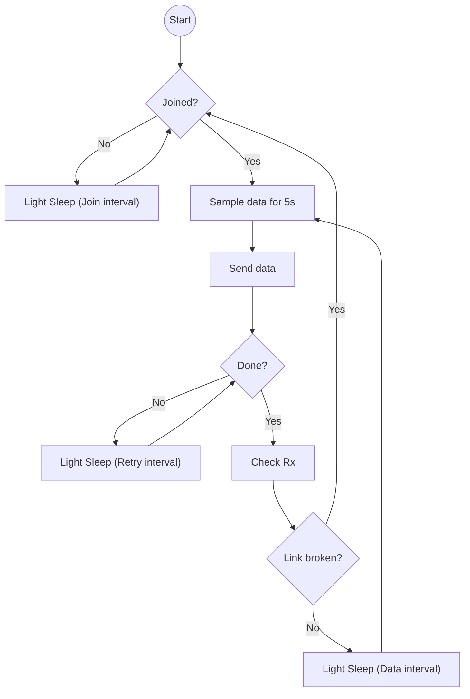

# Example LoRa Device

This is an example LoRa device. It using the LoRa Component to connect to the LoRaWAN. Then sending data every 120s.


## Development

1. Set target at first time.

   ```
   idf.py set-target esp32s3
   ```

    

2. Build the project.

   ```
   idf.py build
   ```
   
      

4. Download to the target.

   ```
   idf.py flash -p /dev/ttyACM0
   ```


# Main software structure


# Flow for AppOp



*If enabled `MATCHX_ENABLE_DEEP_SLEEP`, it will enter deep sleep instead of light sleep at join interval and data interval. Deep sleep during retry will stop the retry process.*


# Hints for low power

To achieve a lower power consumption during sleep, please remove the two pull-up resistors on I2C bus and enable `MATCHX_SLEEP_PULL_I2C_LOW`. Therefore, the I2C pin will pull low during sleep and makes the battery management IC (BQ27220) using less power.
