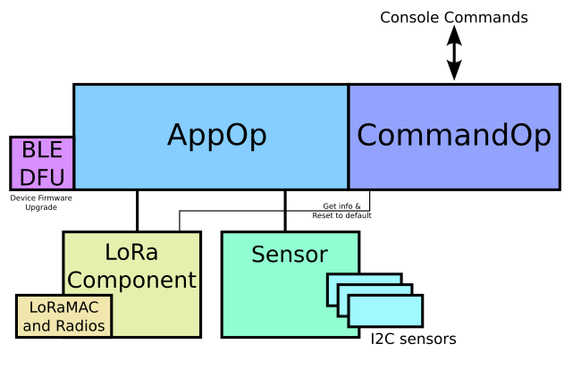

# Example LoRa Device

This is an example LoRa device. It using the LoRa Component to connect to the LoRaWAN. Then sending data every 120s.


## Development

1. Set target at first time.

   ```
   idf.py set-target esp32s3
   ```

    

2. Build the project.

   ```
   idf.py build
   ```
   
      

4. Download to the target.

   ```
   idf.py flash -p /dev/ttyACM0
   ```


# Main software structure



# Flow for AppOp


