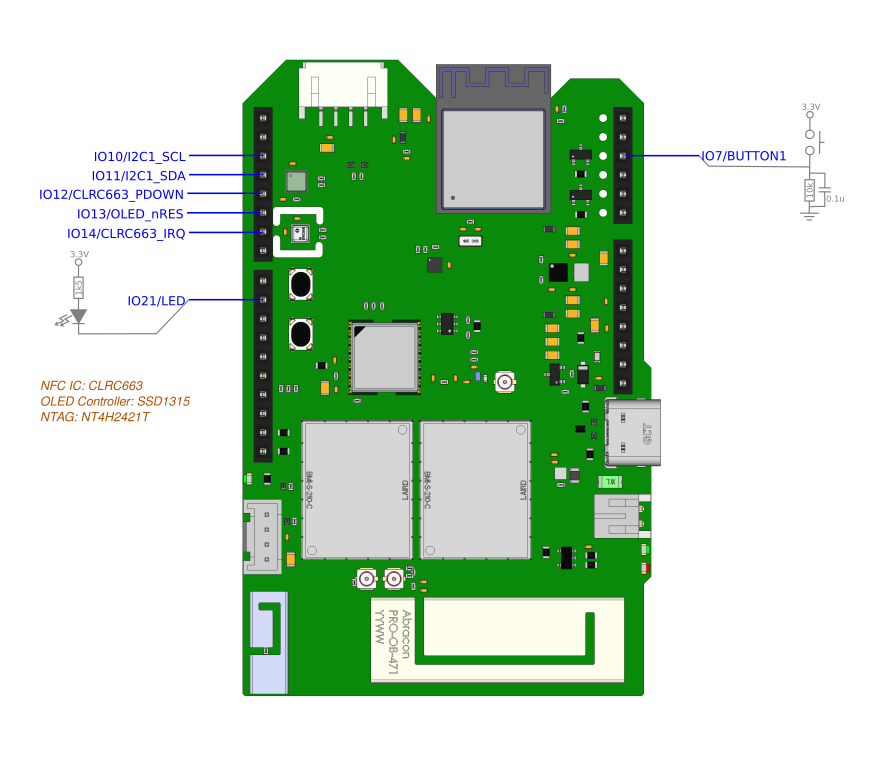
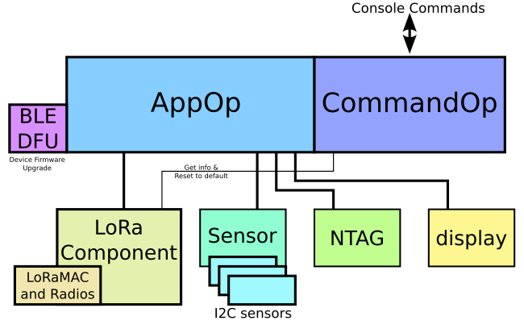
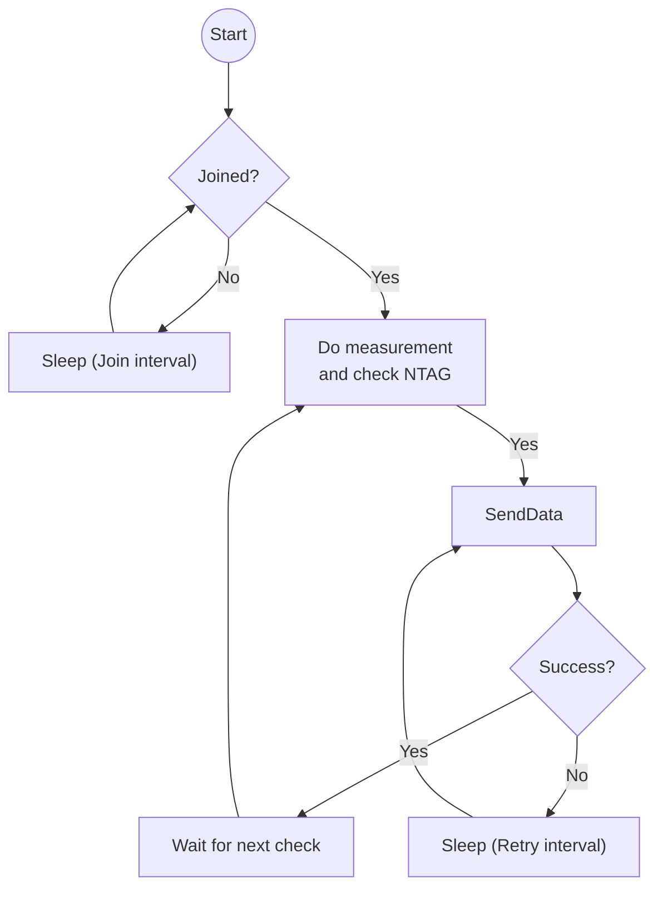

# NTAG Validator

The NTAG Validator verifies the built-in NFC tag of the target object and transmits the result to the ChirpVM via LoRa.


## Development

1. Build the project.

   ```
   idf.py build
   ```

      

2. Download to the target.

   ```
   idf.py flash -p /dev/ttyACM0
   ```


## Hardware connections




## Main software structure



## Flow for AppOp



*If enabled `MATCHX_ENABLE_DEEP_SLEEP`, it will enter deep sleep instead of light sleep at join interval and data interval.*


## Console commands

The default console is via the USB connection. The command format is line based and AT like. A success command will return a `OK` string. If there is response, it will return before the `OK`.

#### Command List

| Command             | Description                                                  |
| ------------------- | ------------------------------------------------------------ |
| AT+CQRCODE?         | Get the QR Code string. It is in JSON format and included the Provision ID (PID). It should equal to the QR-Code label printed on the device. |
| AT+CQRCODE=*string* | Set the QR Code string. Maximum 127 characters.              |
| AT+CLORA?           | Get the LoRa information, such as DevEUI.                    |
| AT+IREBOOT=0        | Soft reset the device.                                       |
| AT+IREBOOT=8        | Reset app data and LoRa data to default values.<br />The settings (QR Code) will remain unchanged. |

Example - Set QR Code:

```
AT+CQRCODE={"PID":"PIDOOOOOOOOOOOOOOOOOOOOO","B":"MatchX","M":"X2E","V":"1.1"}
OK
```


Example - Get QR Code:

```
AT+CQRCODE?
+CQRCODE:{"PID":"PIDOOOOOOOOOOOOOOOOOOOOO","B":"MatchX","M":"X2E","V":"1.1"}
OK
```


## Button

Press and hold the user button for 5s will bring up the BLE DFU server. Then you could use the Nordic DFU mobile App.

https://play.google.com/store/apps/details?id=no.nordicsemi.android.dfu&hl=en&gl=US

https://apps.apple.com/tt/app/nrf-device-firmware-update/id1624454660  (require iOS 16)


## LED

| Mode                   | Description                      |
| ---------------------- | -------------------------------- |
| LED_MODE_ON            | Steady on.                       |
| LED_MODE_FAST_BLINKING | Blinking at 50ms on, 50ms off.   |
| LED_MODE_BLINKING      | Blinking at 200ms on, 200ms off. |
| LED_MODE_SLOW_BLINKING | Blinking at 500ms on, 500ms off. |
| LED_MODE_SHORT_PULSE   | Blinking at 50ms on, 950ms off.  |
| LED_MODE_OFF           | Steady off.                      |

